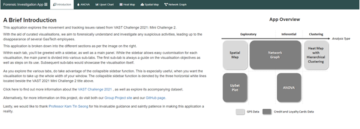

```{r setup, include=FALSE}
knitr::opts_chunk$set(echo = FALSE)
```

RShiny application and guide: [Forensic Investigation App](https://isss608-2021g1g10.shinyapps.io/STFA/)

RShiny guide PDF: [Application Guide](https://github.com/syedahmadzaki/ISSS608.2021G1G10/blob/master/app_guide.pdf)

GitHub: [Project GitHub](https://github.com/syedahmadzaki/ISSS608.2021G1G10)




