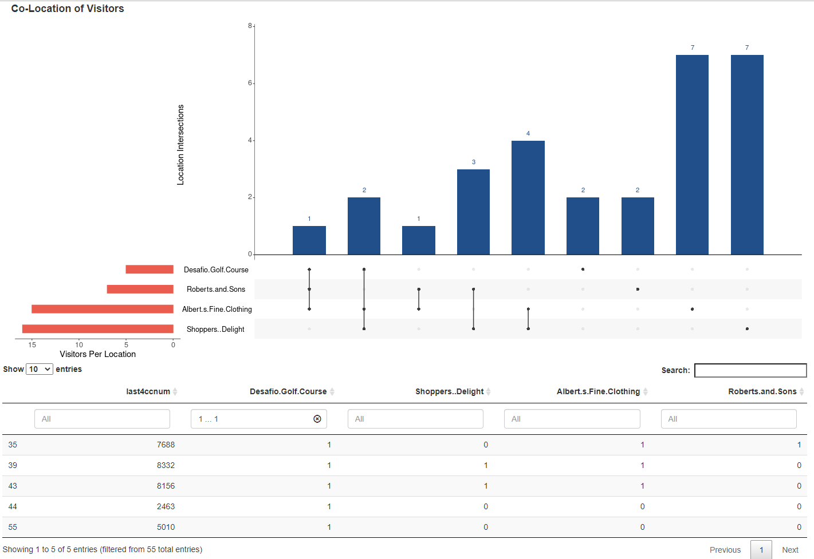

# Introduction 

Almost every action leaves a digital trail. Major technological shifts in the past decade have made the collection of digital evidence, such as GPS records and payment transactions, a significant tool in criminal and civil investigations(@goodison2015). It is crucial that law enforcement agencies could use and transform the ample data into insightful information to aid their investigations. The growth in volume and variety of digital data increases the time and resources needed to analyse them. Furthermore, cases increasingly the analysis of multiple devices followed by the correlation of the found evidence.

However, most law enforcement personnel lack training in data science. Without effective data analysis, investigators will struggle to find relevant information for their cases. And the results of the digital evidence analysis can be challenged in court when not well-represented.

Given that most of the work in digital forensics involves association to individuals, law enforcement agencies need forensic tools to approach identity management. Work in this area will allow for the identification of likely suspects and other anomalies. By integrating interactive visualisation with automated analysis techniques, digital data can be presented in meaningful ways and allow investigators to interactively guide their investigation. 

Addressing this challenge, we designed and developed the Forensic Investigation App, an open-source interactive application, to allow law enforcement agents to conduct investigative analysis of GPS and credit card data. It aims to simplify data exploration and analysis to gain valuable insights into the behaviour of individuals quickly. The prototype is built upon VAST Mini Challenge 2's task to find unusual patterns in GASTech employees' credit card records and GPS tracking records of their cars. We demonstrate the potential of FIA with five visualisations to explore data exploration, inferential analysis and clustering of credit card transactions and GPS data.

This paper documents our approach to design and develop the interactive application targeted at law enforcement agencies without full time support of a data science team. This introduction is followed in Section 2 by an explanation of our objectives and motivation. Section 3 provides a review of existing techniques used to visualize GPS and credit card data. Section 4 details the data used. Section 5 provides an overview of the application and its visualisations. Section 6 summaries the findings from the use case. Section 7 concludes the report and offers ideas for further development.

# Motivation and Objectives

Our research and development efforts were motivated by the absence of an effective and easy to use web-enabled client-based visual analytics tool for investigators to discover patterns in digital data, such as GPS and credit card transactions. 

The interactive tool aims to address the following analysis requirements from the VAST Mini Challenge use case:
- Are the locations and individuals statistically different in mean spend? 
- How many visitors went to location A, B, C and D? Who are they?
- What is the visit frequency of a specific staff to a particular location? 
- Can either the staff or the locations be clustered into groups, based on similarity? 
- How long did a staff stay in a particular location on a particular day? 
- Are there any staff who exhibited similar movement patterns? 
- Which location connects the individuals?

# Review of Existing Techniques

## Visualizing Set Data
Understanding relationships between sets is a common visual challenge that many analysts face. Venn diagrams has been the traditional choice of graphics adopted to make sense of sets data. However, as the number of sets increase, the Venn diagrams becomes too complex to and puts burden on the readers. An investigator who would like to see the size of the co-location of individuals of more than 4 locations will struggle without a proper tool. For example, R package such as ‘Venn’ can only draw and display up to 7 sets, as shown in Fig 1, and the results take time to interpret. 

To overcome this problem, we can adopt the visualisation technique using UpSetR package. This will help us breakdown the information into parts: i) visualising the total set size and ii) visualising the intersect size. 

## Spatial Map
The use of a map has been mentioned to be among the most persuasive visualisations because the space they map is the same one we think we live in, and maps may show more than otherwise seen (@bivand2013). The availability of geographic data allows for the study of spatial relationships between locations, boundaries, and objects. By leveraging on a geographic information system (GIS), a greater comprehension of the geography can be sought, beyond traditional visualisations. Geographical features, coupled with tabular data, are manipulated, queries and visualized into GIS layers. These GIS layers, either in the form of points, lines, polygons, or raster, are then overlaid on a map. Adding to traditional interactive functions of zooming, these layers add another level of map interactivity.

GIS has traditionally been limited to customized GIS software such as the ubiquitous ESRI ArcGIS (Figure 2) platform and the open-source QGIS. Only recently has R added GIS packages, to complement its powerful array of statistical computing and graphics packages. These GIS packages cover both the geospatial manipulation (sp and sf packages) as well as the map visualization (leaflet and tmap packages). This is especially appealing, since the whole process of data import, manipulation, conversion to GIS formats and subsequent enhancements can now all reside within the R environment. The same process is not as seamless in customized GIS software, and thus rely heavily on external software such as Excel or statistical tools, to manipulate traditional data formats.

## Network Graph
Leveraging visuals such as scatterplots, histograms and bubble charts, relationships between entities in datasets can be fleshed out. These charts allow for a quick overview and identification of relationship patterns. In addition, statistical methods such as correlation, can denote the strength of relationships between quantitative variables. Specifically, using Cohen’s d to measure the difference in standard deviation between two groups in a population, and Pearson’s r to measure the strength of a linear association (@price2012). As an example, the scatterplot below shows the moderately negative relationship between temperature against elevation using Pearson’s r.

While these methods are useful, they are not sufficient to visualise complex relationships between elements. To thoroughly visualise and investigate relationships, Network Graphs should be used. Network Graphs are powered by graph theory, that transforms the entities and connections within datasets (@carlson2020) to nodes and edges respectively. These graphs can flesh out i) relationships between all the entities within the dataset; ii) number of connections each entity has; and iii) importance of relationships that connect the entities. In addition to visualisation, Network Graphs can be statistically analysed to highlight underlying relationships using methods such as, i) degree centrality – the number of ties to a node, and ii) eigenvector centrality – the node’s importance within the network (@rdrr2020). Network Graphs are often used to analyse transportation and social media networks.

# Data 

Our data was obtained from Mini-Challenge 2 within the annual IEEE Visual Analytics Science and Technology (VAST) Challenge 2021. It has provided vehicle tracking data and credit card purchases of the GASTech employees 2 weeks before the disappearance of several employees to support the investigation in csv format. Data was cleaned and transformed using in R using base R and the dplyr package. These activities are performed by server side of the application and hidden from the user.

# The Application

## System Architecture
FIA is an interactive tool developed using Shiny, an R package used to build interactive web apps and various R packages. We used RShiny client-server architecture to deploy the plots as its open-source nature ensures a modularised and reproducible work flow that can distributed easily cross different environments. 

The dashboards within the FIA app were designed to show specific visualisations: i) ANOVA, ii) UpSet Plot, iii) Dendrogram Heatmap, iv) Spatial Map, and v) Network Graph. Reactive programming model in Shiny allows users to interact with customisable widgets and view the changes to the visualisations when users modify the input. This enables users to explore the dataset and derive insights efficiently.   

## Data Visualisation

### ANOVA
One-way ANOVA is used to determine whether there are any statistically significant differences between the means of three or more independent groups. The ggbetweenstats function from ggstatsplot package was used visualise the output of ANOVA tests. The function supports the most common types of hypothesis tests, including Welch’s one-way ANOVA for parametric data, Kruskal–Wallis one-way ANOVA for non-parametric, Fisher’s ANOVA for Bayes Factor. It also overcomes the omnibus test nature of ANOVA by selecting the appropriate post-hoc pairwise comparison tests and showing results directly within the plots.

The app enables the user to select the groups that they would like to explore and the univariate distributions for each group are displayed in the panel based on the bin size selected. Based on the understanding of the data distribution, users can then select the appropriate test statistics (including parametric, non-parametric, robust and Bayes Factor) for the ANOVA test.

### UpSet Plot
UpSet plots overcomes the set size limitation of Venn Diagrams with a novel way to view set data by the size of their intersections. It avoids the visual complexity of Venn Diagrams and focuses on communicating the size and properties of the set aggregates and interactions with bar charts. The UpSetR package was used to build the Upset plot in the app. This package requires the dataset to be in binary matrix format, with the columns representing the universe of sets. It allows users to change visualization attributes to explore the intersections between the sets. 

To facilitate data exploration, the app provides users with the option to select the sets of interest, select the method of ordering of intersections and showing empty intersections. User can make use of the chart to explore the size of each set combinations. Format settings are also included to allow users to modify the aesthetics so that it can be readily included in reports. 

### Heatmap Dendrogram
A heatmap would allow for easy visualisation of frequencies between two categorical variables, while a dendrogram would allow for better analysis of similarities within these same variables. To achieve these aims, the Heatmaply package was employed to marry both the heatmap and dendrograms into a single interactive visualisation. The app allows users to customise the dendrogram settings, such as its seriation, clustering, and distance method, while at the same time, enabling the user to interact with the heatmap via the use of its zoom and tooltip functions.

### Spatial Map
Maps are usually the go-to visualisation for spatial data. It allows the user to interact with the map to understand both movement trails and proximity of locations from each other. For this, both the sf and tmap package was employed. The sf package provides users with a comprehensive list of spatial data manipulation. Separately, the tmap package allow users to visualise these spatial data on a map, along with its related map functionalities.

### Network Graph
Unstructured and structured data can be used for Network Graphs, and the datasets must be carefully prepared into nodes, and edges data. Minimally, the nodes dataset contains columns with i) “id” - a unique identifier for the node to the edge; and ii) “label” - the name of the variable.  The edges dataset must contain at least i) “id” – maps the node to the edge data; ii) “from” (source); and iii) “to” (target) columns. The “from” and “to” columns map the relationship between the source and target. 

In R, the visNetwork package provides the dexterity to customize the Network Graph, such as, its layout, node image, edge colour and opacity, font size and edge direction (@thieurmel2019). Credit card and loyalty card data was used in the package to explore relationships between i) credit card expenditure-location, and ii) loyalty card expenditure – location. The app has features for the user to customize the network display and understand the networks' eigenvalue and degree centrality. The default layout is force-directed, which tries to produce a nice visual. The graph has a zoom function and nodes can be dragged to explore specific points-of-interest (POI). 

# Case Study: VAST Mini Challenge 2
The final interactive plots in the published web application, and an illustration of the potentially wide range of insights that can be gleaned from the application are briefly described below.

## ANOVA
We demonstrate the testing of difference in mean spend across locations and credit card users using the ANOVA plot (Figure 4). User can select the locations of interest from the main panel after exploring the data in the ‘EDA’ tab. ‘Brew’ve Been Served’, ‘Jack’s Magical Beans’, Kalami Kafenion’ and ‘Guy’s Gyros’ are selected by default. If the univariate distributions from the histograms reveal skewedness, the user can make judgement to select a non-parametric test. The visualization automatically picks a Kruskal-Wallis test at 95% confidence level. The ANOVA results shows that there are significant differences between the spend across the locations (p <0.01). The Dunn test is the automatically selected as the post-hoc pairwise test, which displays significant comparisons on the chart. Of which, results show that ‘Brew’ve Been Served’ and ‘Guy’s Gyros’ have significantly different spend (p < 0.01). This provides evidence for the users to support the claim that these locations are of different nature.

## UpSet Plot 
Users can explore the co-location of individuals within various time windows via UpSet plot. The UpSet plot allows user to – at a glance – gather information about the number of visitors to a location and how the size varies when intersecting with other locations. For example, Figure 5 shows that if a user would like to know how many of the visitors who visited the Golf Course also visited the other retailers during the whole observation period, one can select the locations in the side panel and order the intersections by degree. The plot shows that of the 5 individuals who visited ‘Desafio Golf Course’, 1 of them also visited ‘Roberts and Sons’ and ‘Albert’s Fine Clothing’ and 2 other visited Albert’s Fine Clothing and ‘Shopper’s Delight’. The data table will dynamically display the individuals based on the selected locations to allow users to drill down into the members within each intersections.

## Heatmap Dendrogram
From the colour intensity within the heatmap (Figure 6), the user can discern the frequency of visit of each staff to a location. Based on the agglomerative hierarchical clustering, the dendrograms for both the row and columns cluster similar staff and locations respectively based on similarity. A whole host of dendrogram settings are provided for the user to customize his visualization, ranging from the distance, clustering, and seriation method to showing either the row or column dendrograms. When a user selects Euclidean distance as its preferred distance method, the clustering is computed based on the square root of the sum of the square differences of the visit frequency between each location / staff respectively. When a user selects Complete as its linkage method, low-level clusters are then clustered into higher order clusters based on its maximum distance from each cluster.

Using this heatmap, for example, the user would be able to tell that the movements of security staff are clustered together (no surprises there!) and on a few occasions, they have visited the homes of GASTech executives, which prompts further investigation.

## Spatial Map
Users can select the date of interest and compare the routes taken by three employees from the settings on the side bar panel. From the movement lines and the table, the user can see the path taken by the employees, locations visited, and duration stayed in each visited location on the spatial map (Figure 7). For example, the user would be able to tell that Drill Technician Elsa (blue dashed line) and Brand (red dotted line) frequent the same locations together, and that Drill Technician Isande (black solid line) drove in a wayward manner

## Network Graph
Thicker lines and nodes clustered close to each other indicate popular locations and closer relationships on the Network Graph (Figure 8). Selecting a node highlights immediate relationships, from which the user can further explore secondary relationships and connection paths. Users can seek out specific networks by searching credit card, loyalty card and location POI. Selecting a POI fleshes out related nodes within the network. This would provide a sense of informal relationships within a network by location. 

In addition, inferential statistics analysis is done when the user selects eigen and degree analysis. This highlights the important and popular relationships respectively within the POI’s network. Important relationships include nodes that have few but well-connected connections. The node colours fade in tandem with relationship importance. Popular relationships are nodes with many connections.  

# Future Work
As digital data from different devices can be represented in different formats, there is a need to guide users on the steps to process the raw data files. The application could provide users an interface to upload, clean and step-by-step guide to transform data files into appropriate format for each visualisation. This would reduce the time taken and eliminate the for investigators to learn how to process the data before uploading them into the application. 

The interactivity and analytical features of FIA prototype can also be further enhanced based on the common needs of investigators. We suggest the app can incrementally address:

- Allow investigators to explore the surroundings of locations within a single app. This includes enhancing the tmap package to link up to actual images of road and environment (e.g. Google Street Map).
- The Network Graph could be improved with additional options for analysis. For example, including community detection analysis that will reveal hidden relations among the nodes to investigators. In addition, closeness analysis could be included to understand the average number of hops required to reach every other node in the network. Investigators could use this information to narrow down suspects.
- Enable the exploration of other metadata by including brushing-and-linking of different types of charts and embed drill-downs to provide details on demand.
- Expand the scope of the app to include other digital data such as weblogs.

To ensure that insights from the tool is reliable and can be admissible in court, the app needs to be validated by forensic investigation specialists before distribution. It should also undergo a period of user testing to prove that it is error-free and can operate in all environment, including being hosted on private clouds or on-premise servers. 

# References

---
references:
- id: goodison2015
  title: Digital Evidence and the U.S. criminal Justice System - Identifying Technology and Other Needs to More Effectively Acquire and Utilize Digital Evidence 
  author: 
  - family: Goodison
    given: Sean E.
  - family: Robert
    given: C. Davis
  - family: Brian
    given: A. Jackson
  volume: 890
  URL: ‘https://www.rand.org/pubs/research_reports/RR890.html’
  publisher: RAND Corporation
  type: article-journal
  issued:
    year: 2015    
- id: garfinkel2010
  title: Digital Forensics Research - The Next 10 Years
  author: 
  - family: Garfinkel
    given: Simson L.
  type: article-journal
  publisher: Digital Investigation
  volume: 7
  page: S64-S73
  URL: ‘https://doi.org/10.1016/j.diin.2010.05.009’
  issued:
    year: 2010
    month: August
- id: price2012
  title: Psychology Research Methods - Core Skills and Concepts (v. 1.0)
  author: 
  - family: Price
    given: Paul C.
  type: book
  publisher: Lard Bucket
  URL: ‘https://2012books.lardbucket.org/books/’
  issued:
    year: 2012
- id: carlson2020
  title: Graph theory
  author: 
  - family: Carlson
    given: Stephan C.
  type: article-journal
  publisher: Britannica
  URL: ‘https://www.britannica.com/topic/graph-theory’
  issued:
    year: 2020
    month: November  
- id: rdrr2020
  title: Tidy Graph Centrality
  type: web site
  publisher: rdrr.io
  URL: ‘https://rdrr.io/cran/tidygraph/man/centrality.html’
  issued:
    year: 2020
    month: July  
- id: sasjmp
  title: Statistical Knowledge Portal - What is Correlation
  type: Web site
  publisher: SAS JMP
  URL: ‘https://www.jmp.com/en_ch/statistics-knowledge-portal/what-is-correlation.html’
- id: thieurmel2019
  title: Network Visualization using 'vis.js' Library
  author: 
  - family: Thieurmel
    given: Benoit
  URL: ‘https://cran.r-project.org/web/packages/visNetwork/visNetwork.pdf’
  type: Web site
  issued:
    year: 2019
    month: December
- id: bivand2013
  title: Applied spatial data analysis with R (2nd ed)
  author: 
  - family: Bivand
    given: Roger S.
  - family: Pebesma
    given: E
  - family: Gaomez-Rubio
    given: V
  type: book
  publisher: Springer
  issued:
    year: 2013
...
