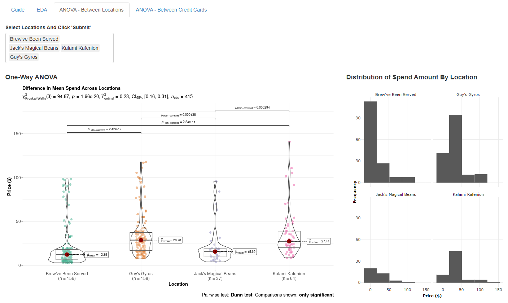
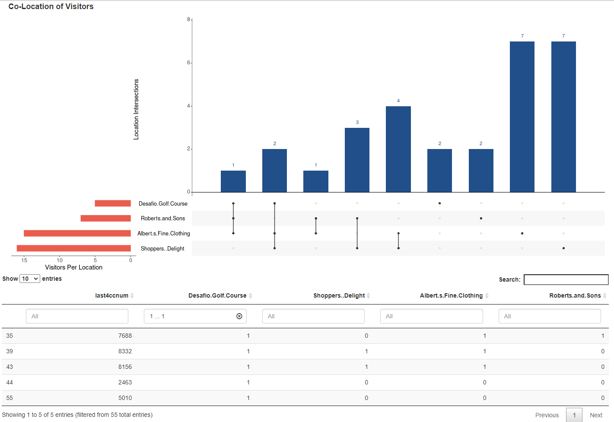
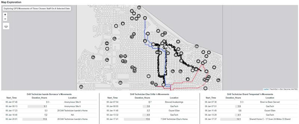
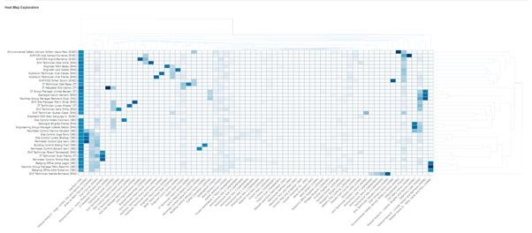

---
# Title Box
title: Forensic Investigation - Interactive Visual Analysis with R Shiny <br>
title_textsize: "70pt"
author_textsize: "30pt"
affiliation_textsize: "45pt"
author:
  - name: <br>Kelly Koh Kia Woon 
    affil: 
    email: kelly.koh.2020@mitb.smu.edu.sg
  - name: Manmit Singh
    affil: 
    email: manmits.2020@mitb.smu.edu.sg
  - name: Syed Ahmad Zaki Bin Syed Sakaf Al-attas
    affil: 
    email: ahmadzaki.2020@mitb.smu.edu.sg
  - name: <br> Prof Kam Tin Seong (Mentor)
    email: tskam@smu.edu.sg
    main: true
affiliation:
  - num: 
    address: School of Computing and Information Systems, Singapore Management University
    
# Body
poster_height: 841mm 
poster_width: 594mm
column_numbers: 3
body_textsize: "22pt"

output: 
  posterdown::posterdown_html:
  #posterdown::posterdown_betterland:
  #posterdown::posterdown_betterport:
    self_contained: false
bibliography: packages.bib
---


---

```{r setup, include=FALSE}
knitr::opts_chunk$set(echo = FALSE)
```

# Introduction and Motivation

**Background**<br>
Forensic Analysis has proliferated digital forensics which involves transforming data into insightful information to aid investigations. Searching through data such as credit card and travel data, law enforcement agencies can quickly seek out anormalies and identify suspects. By creating forensic tools with interactive visualization and automated analysis techniques, digital data can be presented in meaningful ways. 

**Objective**<br>
Design and develop a Forensic Investigation App (FIA), an interactive dashboard that allows law enforcement agents to conduct investigative analysis of GPS and merchant card data. The application is built on VAST Mini Challenge 2's task to find unusual patterns in GASTech employees credit card records and GPS tracking records of their cars. 

**Design Principles**<br>

- <u>Simplicity and Clarity</u> - Aesthetically clean, easy to configure visuals and seamless user experience.
- <u>Interactivity</u> - Provide the flexibility for the user to customize visuals and explore data.
- <u>Utility</u> - Perform exploratory and inferential data analysis, supported by different visualisations.


**Data Sources**<br>
Data was obtained from Mini-Challenge 2 within the annual IEEE Visual Analytics Science and Technology (VAST) Challenge 2021. The data includes i) csv files of vehicle tracking, credit card and loyalty card purchases of the GASTech employees two weeks before the disappearance of several employees; and ii) geo-spatial files of the island.


**Analytical Approach**<br>
The interactive tool aims to address the following analysis requirements:
(1)	Are mean spends of the locations and individuals statistically different?
(2)	Can either the staff or the locations be clustered into groups, based on similarity?
(3)	How long did a staff stay in a particular location on a particular day? 
(4)	Did any staff exhibit similar or wayward movement patterns? 
(5)	Which are the locations of importance within the staff networks?

**Application Overview**<br>
FIA is an interactive tool developed using Shiny and various R packages ggplot2, tidyverse and heatmaply, to build interactive web apps. Users are able to customise visualisations and within the application. The application is reproducible, and can distributed easily.
 <br>
 <br>
 <br>
 <br>
 <br>
 <br>
 <br>
 <br>
 <br>
 <br>
 <br>
 <br>
 
 
# Analysis and Insights
\vspace{-100pt}
#### Case Study: VAST Mini Challenge 2
\vspace{-100pt}
**Interactive ANOVA**<br>
The *ggbetweenstats* function from *ggstatsplot* package was used to visualise the output of ANOVA tests. The function supports the most common types of hypothesis tests, including Welch’s one-way ANOVA for parametric data, Kruskal–Wallis one-way ANOVA for non-parametric, Fisher’s ANOVA for Bayes Factor.

\vspace{-100pt}
```{r pressure2, echo=FALSE, out.width = '100%'}

```
\vspace{-100pt}
**Interactive Upset Plot**<br>
UpSet plots provide a novel way to view set data by the size of their intersections. It focuses on communicating the size and properties of the set aggregates and interactions with bar charts. The *UpSetR* package was used to build the Upset plot. This package requires the dataset to be in binary matrix format, with the columns representing the universe of sets. Users can change visualization attributes to explore the intersections between the sets. 

\vspace{-100pt}
```{r pressure3, echo=FALSE, out.width = '100%'}

```
\vspace{-100pt}

**Interactive Spatial Map **<br>
The *tmap* package was used to build the spatial map.From the movement lines and the table, the user can see the path taken by the staff, locations visited, and duration stayed in each visited location. For example, the user would be able to tell who frequent the same locations together, and that if staff drove in a wayward manner.
\vspace{-100pt}

```{r pressure4, echo=FALSE, out.width = '100%'}

```
\vspace{-100pt}

**Interactive Heat Map with Dendrogram**<br>
The *heatmaply* package was used to build the heat map with dendrogram. From the colour intensity within the heatmap, the user can discern the frequency of visit of each staff to a location. The dendograms for both the row and columns cluster similar staff and locations respectively based on similarity. For example, the user would be able to tell that the movements of security staff are clustered and visited the homes of GasTech executives.
\vspace{-100pt}
```{r pressure5, echo=FALSE, out.width = '100%'}

```
\vspace{-100pt}

**Interactive Network Graph - Eigenvector & Degree Analysis**<br>
The *visNetwork* package was used to generate the UI for the Network Graph. Thicker lines and nodes clustered close to each other indicate popular locations and closer relationships. Selecting a node highlights immediate relationships, from which the user can further explore secondary relationships and connection paths. The eigen analysis highlights important relationships within an individual's network, degree analysis highlights popular relationships (nodes with many connections) 
\vspace{-100pt}
```{r pressure6, echo=FALSE, out.width = '100%'}
knitr::include_graphics("vis.png")
```
\vspace{-100pt}

# FUTURE WORKS
(1) The application could provide users an interface to upload, clean and step-by-step guide to transform data files into appropriate format for each visualization.

(2) In addition, *tmap* package can be enhanced to link up to actual images of road and environment.

(3) Lastly, the Network Graph could have additional options for analysis, such as, community detection.

```{r echo=FALSE, eval=FALSE}
library(pagedown)

pagedown::chrome_print("VAposter.html")


```


